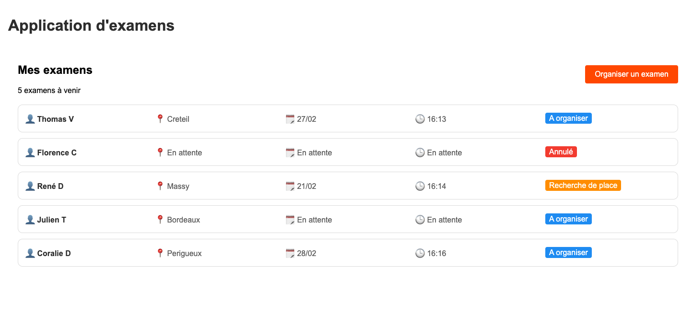

# Test Technique d'En Voiture Simone sur le développement frontend

## Instructions
L'application peut etre lancée avec la commande :
``` docker compose up ```
et ensuite se rendre sur : http://localhost:8080/

## Fonctionnalités

- Liste des examens
- Création d'un examen


## Todo

  - Ajout du module i18n
  - Ajout des tests unitaires
  - Ajout des tests e2e
  - Ajout d'un systeme de feedback pour l'utilisateur (toast) lors de la creation d'un examen
